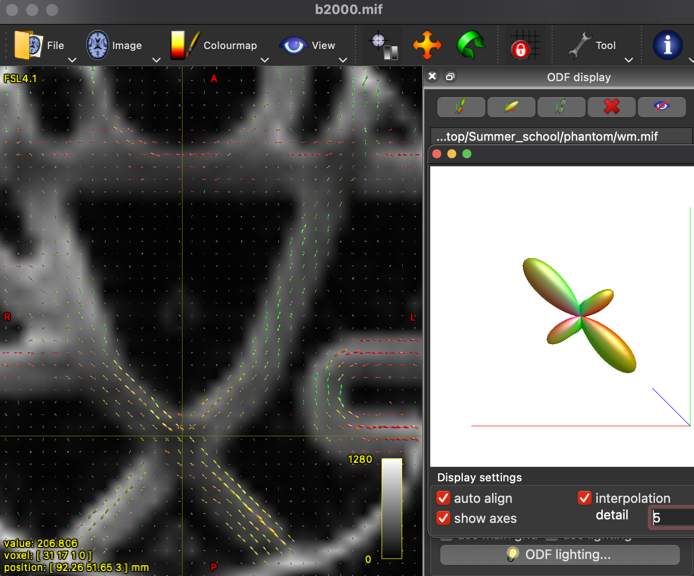

# Fibre Estimation
_by Lawrence Binding_

```{admonition} Estimated Time 
:class: TIP
10 minutes
```

Here we will be estimating our fibre orientation. This may sound familiar as the outcome will be the same as the first days coding task. Don't worry, other people have coding these advanced methods! 

<style>
h1 {text-align: center;}
h2 {text-align: center;}
</style>

--- 

## Data identification
Before we decide which postprocessing method to use, we need to identify if our data was acquired with multiple b-values. Different types of tissue are sensitive to different strengths of diffusion gradient (b-values). We can tell this by looking at our b-value file and seeing if there is more than 2 unique values (e.g., 0, 1000, 2000, etc.). 

--- 

## SingleShell CSD 
The advanced method we're going to use is constrained spherical deconvolution (CSD). This method elimiates all priors but one: All white matter shares identical diffusion characteristics. As such, diffusion is mapped over a sphere of response function with the fibre orinetation density function (ODF). First we need to estimate our responses function with:

```shell
mkdir tournier
dwi2response tournier fibrecup_denoise_gibbs_preproc_biaCorr.mif tournier/wm.txt
```
Then we can map each response to a voxel with: 

```shell
dwi2fod csd fibrecup_denoise_gibbs_preproc_biaCorr.mif tournier/wm.txt tournier/wm.mif 
```
We can inspect our ODFs with the following command: 

```shell
mrview fibrecup_denoise_gibbs_preproc_biaCorr.mif -odf.load_sh tournier/wm.mif 
```
<figure>

<figcaption>Fig.1 - Showing fibre orientation direction after estimation.</figcaption>
</figure>
---

## MultiShell CSD 
Where Multishell differs from single Shell CSD is its ability to only estimate white matter. CSD rests upon the assumption that all white matter is the same, not the entire brain is the same! Multishell CSD takes advantage of the fact different tissues have different diffusion principals so we can estimate WM, GM, and CSF seperately! This comes with the benefit of improved estimation! We can do this by:

```shell
mkdir dhollander
dwi2response dhollander fibrecup_denoise_gibbs_preproc_biaCorr.mif dhollander/wm.txt dhollander/gm.txt dhollander/csf.txt
```
Then we can map each response to a voxel with: 

```shell
dwi2fod msmt fibrecup_denoise_gibbs_preproc_biaCorr.mif dhollander/wm.txt dhollander/wm.mif dhollander/gm.txt dhollander/gm.mif dhollander/csf.txt dhollander/csf.mif
```
We can inspect our ODFs with the following command: 

```shell
mrview fibrecup_denoise_gibbs_preproc_biaCorr.mif -odf.load_sh dhollander/wm.mif 
```

## Single-Shell 3-Tissue CSD (SS3T)
We're not going to cover this method today as it requires a seperate installation of MRtrix3 known as MRtrix3Tissue. This method estimates the 3-Tissues from singleshelled diffusion data. In our experience, this has better performance than just singleshell CSD. You can find more information about this method here: https://3tissue.github.io. 


<style>
  .iframe-container {
		text-align:center;
  		width:100%;
  }
</style>


```{admonition} Further reading
- blah blah 
- blah blah
- blah blah
- blah blah

```
